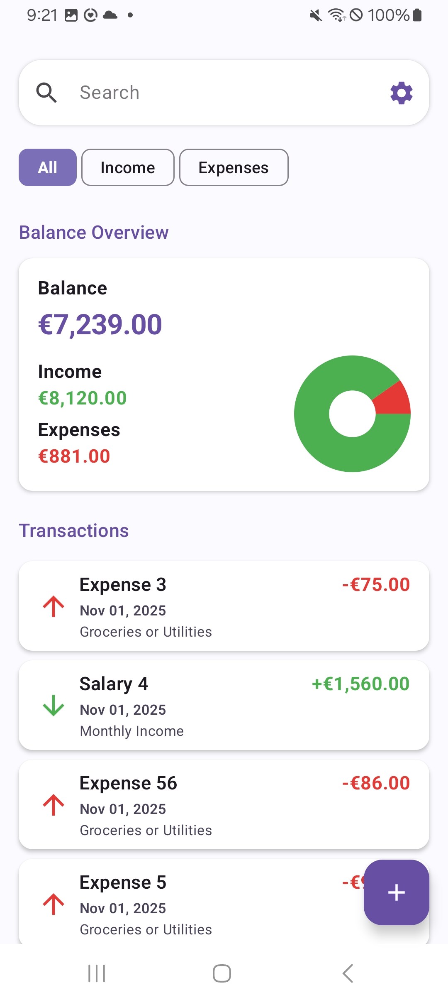
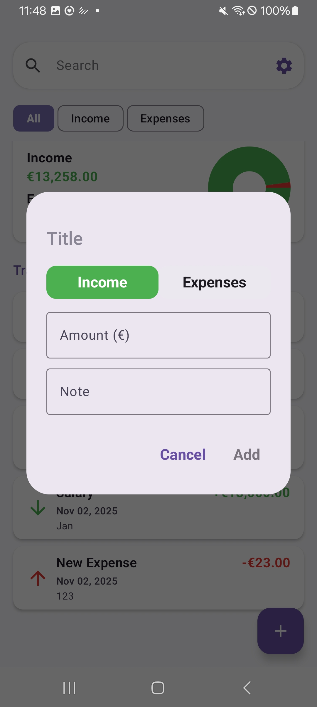
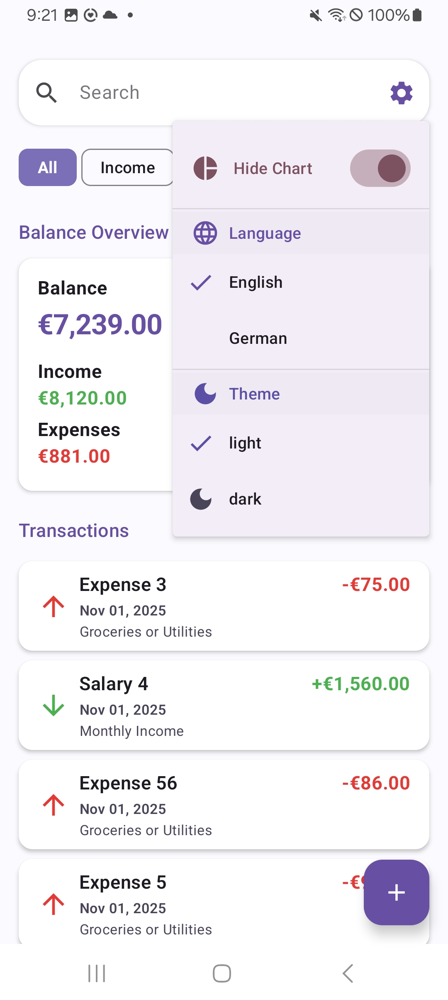

# SpendWise – Budget Tracker Application

A modern single-screen Android application built with Jetpack Compose and Kotlin, designed to help users track income and expenses, visualize their balance summary, and manage finances effortlessly.

## Features

- Add, edit, and delete transactions
- Search and filter by transaction type (Income / Expense)
- View interactive Pie Chart showing income vs. expenses
- Offline-first with Room Database persistence
- Clean Architecture for modular, testable, and scalable codebase
- Reactive UI updates using Kotlin Flow & StateFlow
- Dynamic Light / Dark theme
- Multi-language support (English & German)

## Screenshots

<p align="center">
   &nbsp;&nbsp;&nbsp;&nbsp;
  
  &nbsp;&nbsp;&nbsp;&nbsp;
  
  &nbsp;&nbsp;&nbsp;&nbsp;&nbsp;&nbsp;
  
  &nbsp;&nbsp;&nbsp;&nbsp;
  
</p>

<p align="center">
  <b>Light mode overview</b> &nbsp;&nbsp;&nbsp;&nbsp; | &nbsp;&nbsp;&nbsp;&nbsp;
  <b>Light mode overview</b> &nbsp;&nbsp;&nbsp;&nbsp; | &nbsp;&nbsp;&nbsp;&nbsp;
  <b>Add Transaction Dialog</b> &nbsp;&nbsp;&nbsp;&nbsp; | &nbsp;&nbsp;&nbsp;&nbsp;
  <b>Settings Screen</b>
</p>


## Tech Stack Used

- **Language**: Kotlin
- **UI Framework**: Jetpack Compose
- **Architecture**: Clean Architecture (with MVVM pattern)
- **Dependency Injection**: Hilt
- **Asynchronous Programming**: Kotlin Coroutines & Flow
- **Local Storage**: Room Database (Offline-first persistence)
- **UI State Management**: StateFlow & MutableStateFlow
- **Charts**: Compose Charts (Pie Chart for income vs. expense visualization)
- **Testing**: JUnit  (unit testing)
- **Build Tools**: Gradle (KTS)
- **Localization**: English 🇬🇧 & German 🇩🇪
- **Theming**: Material 3 with dynamic light/dark modes

# Architecture Overview

| Layer | Description |
|-------|-------------|
| **UI (Compose)** | Declarative, reactive UI with Jetpack Compose |
| **ViewModel** | Manages UI state with StateFlow |
| **Use Cases** | Encapsulates business logic, reusable and testable |
| **Repository** | Data abstraction for Room persistence |
| **Database** | Room for offline storage |
| **Dependency Injection** | Managed by Hilt for clean separation of concerns |


## Download APK

A pre-built APK file is available for download to test the app directly on your Android device:

[**Download SendWiseApp.apk**](apk/SpendWise.apk)

*Note: You may need to enable "Install from unknown sources" in your Android settings to install the APK.*

## Run Locally

If you prefer to build and run the app from source:

### Prerequisites
- **Android Studio** (Giraffe or newer version)
- **Android SDK** with minimum API level 28
- **Java Development Kit** (JDK) 11 or higher

### Installation Steps

1. **Clone this repository**
   ```bash
   git clone https://github.com/cherishmashankar/SpendWise.git

2. Open the project in Android Studio (Giraffe or newer)
3. Sync Gradle and wait for dependencies to download
4. Build and Run the app on an emulator or a connected Android device


### Build Configuration
Build Variant: debug
Minimum SDK: 28
Target SDK: Latest stable version
Compile SDK: Latest stable version

- **Build Variant:** debug
- **Minimum SDK:** with minimum API level 28
- **Target SDK:** Latest stable version
- **Compile SDK:** Latest stable version

### Additional Notes
- Ensure you have an Android Virtual Device (AVD) set up or a physical device with USB debugging enabled
- First build may take longer as Gradle downloads all required dependencies

###  Troubleshooting
- If Gradle sync fails → File > Invalidate Caches and Restart
- Ensure you have the latest Android Gradle Plugin and Kotlin plugin installed
- Check that your device/emulator meets the minimum SDK requirement (API 28+)


## License

This project is provided for evaluation purposes only.
All rights reserved © 2025.


